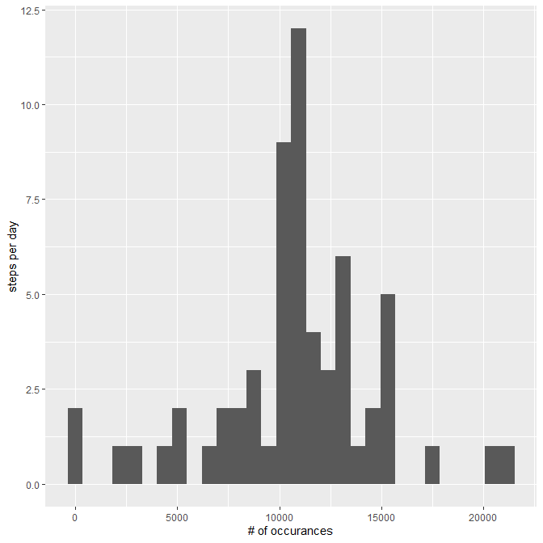
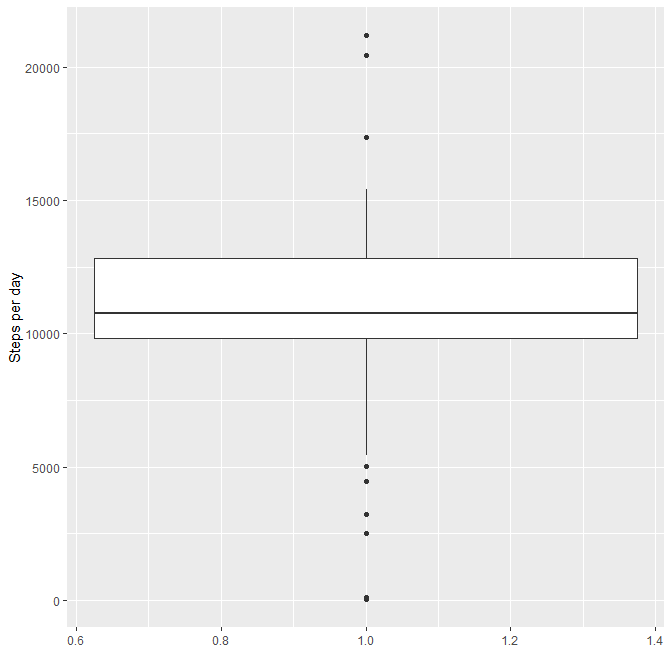
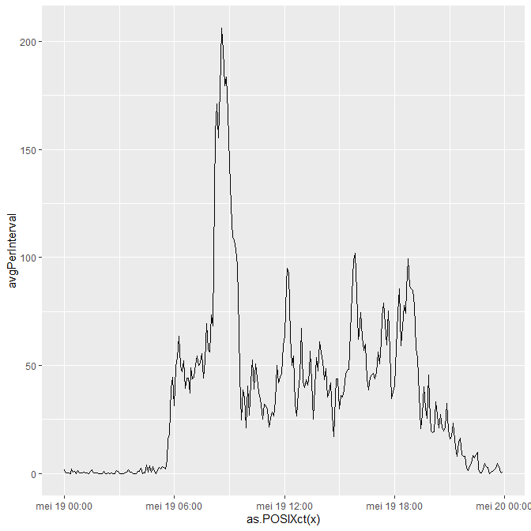
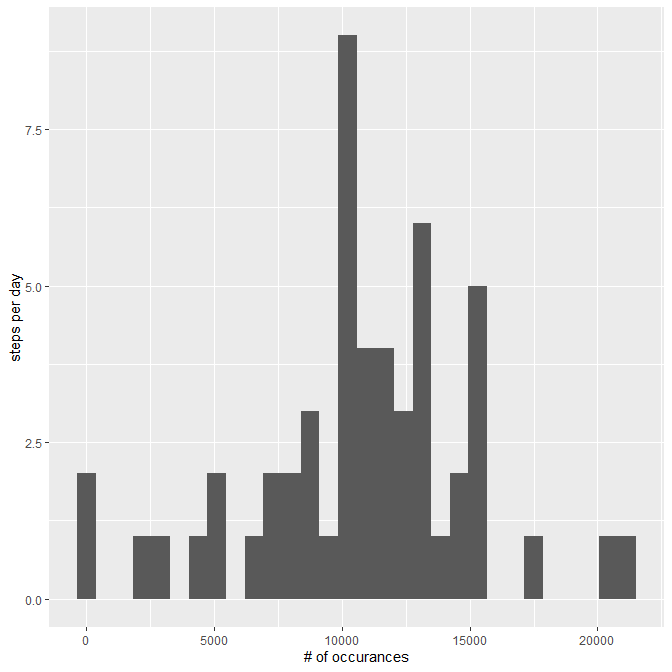
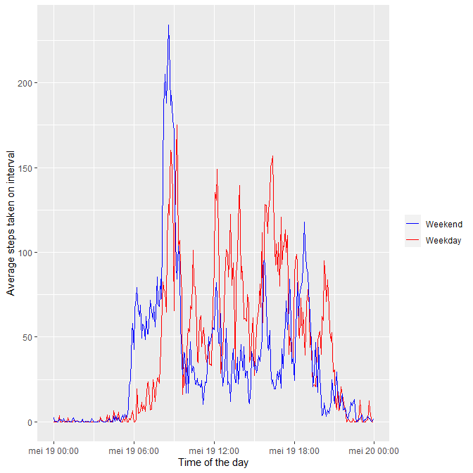

## Loading and preprocessing the data

A first step is to actually load in the data

```r
data <- read.csv("activity.csv", header=TRUE)
```

The next step is to check for missing data values. More specifically, which columns have missing data values, so we can deal with them


```r
print(sum(is.na(data$steps)))
```

```
## [1] 2304
```

```r
print(sum(is.na(data$interval)))
```

```
## [1] 0
```

```r
print(sum(is.na(data$date)))
```

```
## [1] 0
```

As the only missing values are in the steps column, we want to process the date and interval columns to a regular datetime format for ease of analysis later on


```r
data$timeChar <- sprintf("%04d", data$interval)
data$dateParse <- strptime(paste(data$date, data$timeChar),
                           format="%Y-%m-%d %H%M")
head(data)
```

```
##   steps       date interval timeChar           dateParse
## 1    NA 2012-10-01        0     0000 2012-10-01 00:00:00
## 2    NA 2012-10-01        5     0005 2012-10-01 00:05:00
## 3    NA 2012-10-01       10     0010 2012-10-01 00:10:00
## 4    NA 2012-10-01       15     0015 2012-10-01 00:15:00
## 5    NA 2012-10-01       20     0020 2012-10-01 00:20:00
## 6    NA 2012-10-01       25     0025 2012-10-01 00:25:00
```

As far as the missing steps intervals go for some time intervals, we will impute these missing values with the mean value at the same interval of other days which do not have missing values, as this should prevent distortions in out analysis and is easy to implement


```r
intervalMean <- tapply(data$steps, data$interval, mean, na.rm=T)
missingVals <- is.na(data$steps)
data2 <- data  # copy the dataset

for (i in unique(names(intervalMean))) {
  data2[missingVals & as.character(data$interval) == i, 1] = intervalMean[i]
}
```


## What is mean total number of steps taken per day?

First we need to calculate the total number of steps per day

```r
TotalPerDay <- tapply(data2$steps, as.Date(data2$dateParse), sum)
```

A histogram is the easiest way to see what the data looks like using ggplot2


```r
library(ggplot2)
qplot(TotalPerDay, geom="histogram", xlab="# of occurances",
      ylab="steps per day")
```

```
## `stat_bin()` using `bins = 30`. Pick better value with `binwidth`.
```

<!-- -->

And of course a boxplot to better see how the data varies

```r
qplot(1, TotalPerDay, geom=c("boxplot"), ylab="Steps per day", xlab="")
```

<!-- -->


```r
print(median(TotalPerDay))
```

```
## [1] 10766.19
```

```r
print(mean(TotalPerDay))
```

```
## [1] 10766.19
```


## What is the average daily activity pattern?

First we need to calculate the  average number of steps per interval

```r
avgPerInterval <- tapply(data2$steps, data2$timeChar, mean)
x <- strptime(names(avgPerInterval), format="%H%M")
```

Which makes producing a plot very simple

```r
qplot(as.POSIXct(x), avgPerInterval, geom="line")
```

<!-- -->

Where we can see the daily average activity, where the maximum is at


```r
print(avgPerInterval[which(avgPerInterval == max(avgPerInterval))])
```

```
##     0835 
## 206.1698
```

## Imputing missing values

To get a feel for how the imputing of missing values with the mean values affected our analysis, we can make a histogram of the original data and inspect if it is very different


```r
TotalPerDay2 <- tapply(data$steps, as.Date(data$dateParse), sum, rm.na=T)

qplot(TotalPerDay2, geom="histogram", xlab="# of occurances",
      ylab="steps per day")
```

```
## `stat_bin()` using `bins = 30`. Pick better value with `binwidth`.
```

```
## Warning: Removed 8 rows containing non-finite values (stat_bin).
```

<!-- -->

We can see that using our strategy for filling missing values, we have created a new peak (first histogram) with 12 days instead of 4 day, skewing the distribution of the values

## Are there differences in activity patterns between weekdays and weekends?

First we add a weekend variable to the dataset to quickly split the data how we want it: averages per interval for weekdays and weekends


```r
data$weekday <- data$dateParse$wday %in% c(1, 2, 3, 4, 5)

avgWeekend <- tapply(data$steps[!data$weekday], data$timeChar[!data$weekday], mean, na.rm=T)

avgWeekday <- tapply(data$steps[data$weekday], data$timeChar[data$weekday], mean, na.rm=T)

x <- strptime(names(avgWeekend), format="%H%M")
x2 <- strptime(names(avgWeekday), format="%H%M")
```

The easiest way to differentiate these activities is to simple plot them in the same line graph


```r
p = ggplot() + 
  geom_line(aes(as.POSIXct(x), avgWeekend, colour="Weekday" )) +
  geom_line(aes(as.POSIXct(x2), avgWeekday, colour="Weekend" )) +
   scale_colour_manual("", 
                      breaks = c("Weekend", "Weekday"),
                      values = c("blue", "red")) +
  xlab("Time of the day") +
  ylab("Average steps taken on interval")
  
print(p)
```

<!-- -->


